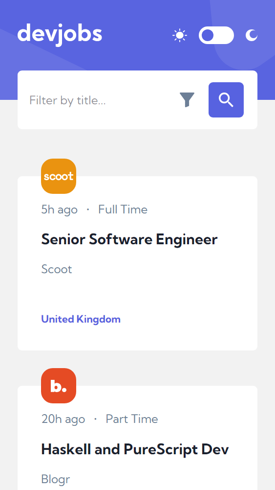
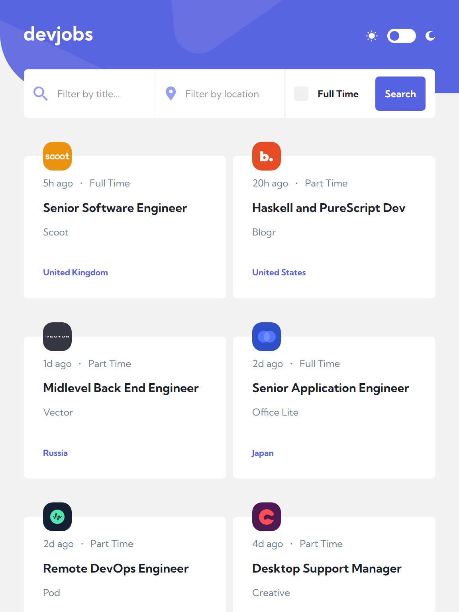
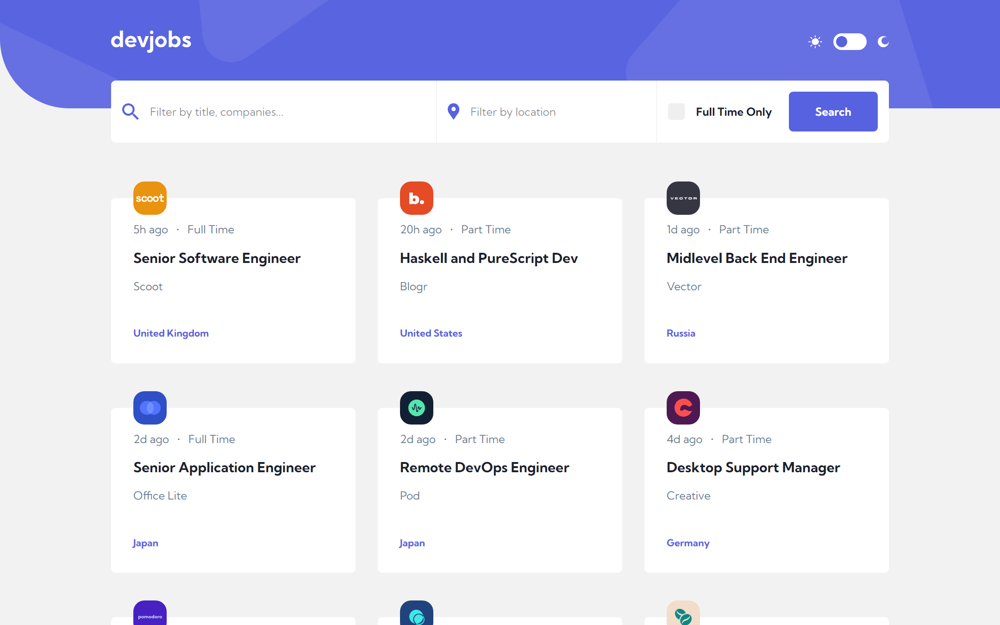
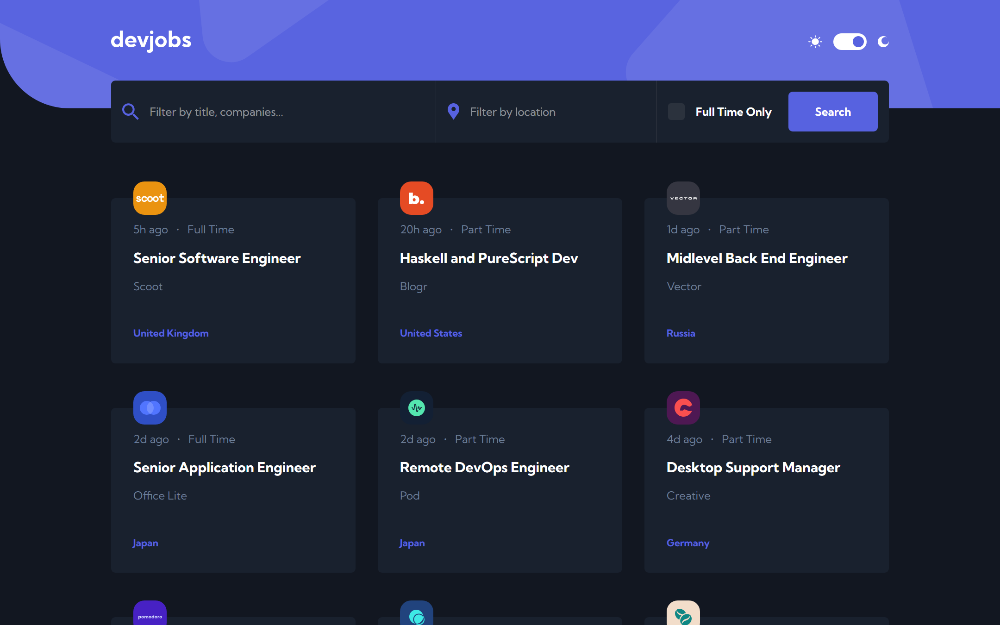

# Frontend Mentor - Devjobs web app solution

This is a solution to the [Devjobs web app challenge on Frontend Mentor](https://www.frontendmentor.io/challenges/devjobs-web-app-HuvC_LP4l). Frontend Mentor challenges help you improve your coding skills by building realistic projects.

## Table of contents

- [Overview](#overview)
  - [The challenge](#the-challenge)
  - [Screenshot](#screenshot)
  - [Links](#links)
- [My process](#my-process)
  - [Built with](#built-with)
  - [What I learned](#what-i-learned)
  - [Continued development](#continued-development)
  - [Useful resources](#useful-resources)
- [Author](#author)

**Note: Delete this note and update the table of contents based on what sections you keep.**

## Overview

### The challenge

Users should be able to:

- View the optimal layout for each page depending on their device's screen size
- See hover states for all interactive elements throughout the site
- Be able to filter jobs on the index page by title, location, and whether a job is for a full-time position
- Be able to click a job from the index page so that they can read more information and apply for the job
- **Bonus**: Have the correct color scheme chosen for them based on their computer preferences. _Hint_: Research `prefers-color-scheme` in CSS.

### Screenshot

### Links

- Solution URL: [https://www.frontendmentor.io/solutions/devjobs-web-app-with-vue-3-zmMPKB3cFh](https://www.frontendmentor.io/solutions/devjobs-web-app-with-vue-3-zmMPKB3cFh)
- Live Site URL: [https://devjobs-web-app-viniciuscosta89.vercel.app/](https://devjobs-web-app-viniciuscosta89.vercel.app/)

## My process

### Built with

- Semantic HTML5 markup
- CSS custom properties
- Flexbox
- CSS Grid
- Mobile-first workflow
- [Vue 3](https://vuejs.org/) - The Progressive JavaScript Framework
- [Pinia](https://pinia.vuejs.org/) - The intuitive store for Vue.js
- [Tailwind CSS](https://tailwindcss.com/) - A utility-first CSS framework
- [Typescript](https://www.typescriptlang.org/) - TypeScript is JavaScript with syntax for types
- [TanStack Query](https://tanstack.com/query/latest/docs/framework/vue/overview) - Powerful asynchronous state management
- [Vue Router](https://router.vuejs.org/) - The official Router for Vue.js
- [Bun](https://bun.sh/) - JS package manager

### What I learned

It was a way to fix Vue 3 and its world in my mind. To get used to Vue 3 features, Pinia, Vue router. And I learned Tailwind because it's my first project with it.

### Continued development

It could improve Vue's folder and file architecture and best practices.
Insert unit and end-to-end tests with Vitest and Playwright.

### Useful resources

I recommend to read each technology documentation.

## Author

- Website - [Vinicius Costa](https://viniciuscosta.dev)
- Frontend Mentor - [@viniciuscosta89](https://www.frontendmentor.io/profile/viniciuscosta89)
